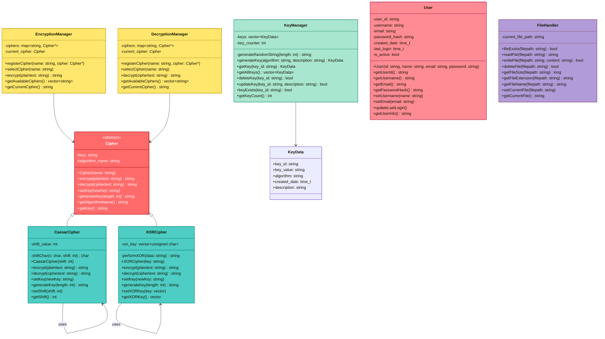

# UML Class Diagram - File Encryption Tool System

```mermaid
classDiagram
    %% Abstract Base Class
    class Cipher {
        <<abstract>>
        #key: string
        #algorithm_name: string
        +Cipher(name: string)
        +encrypt(plaintext: string)* string
        +decrypt(ciphertext: string)* string
        +setKey(newKey: string)*
        +generateKey(length: int)* string
        +getAlgorithmName() string
        +getKey() string
    }

    %% Cipher Implementations
    class CaesarCipher {
        -shift_value: int
        -shiftChar(c: char, shift: int) char
        +CaesarCipher(shift: int)
        +encrypt(plaintext: string) string
        +decrypt(ciphertext: string) string
        +setKey(newKey: string)
        +generateKey(length: int) string
        +setShift(shift: int)
        +getShift() int
    }

    class XORCipher {
        -xor_key: vector~unsigned char~
        -performXOR(data: string) string
        +XORCipher(key: string)
        +encrypt(plaintext: string) string
        +decrypt(ciphertext: string) string
        +setKey(newKey: string)
        +generateKey(length: int) string
        +setXORKey(key: vector)
        +getXORKey() vector
    }

    %% Manager Classes
    class EncryptionManager {
        -ciphers: map~string, Cipher*~
        -current_cipher: Cipher*
        +registerCipher(name: string, cipher: Cipher*)
        +selectCipher(name: string)
        +encrypt(plaintext: string) string
        +getAvailableCiphers() vector~string~
        +getCurrentCipher() string
    }

    class DecryptionManager {
        -ciphers: map~string, Cipher*~
        -current_cipher: Cipher*
        +registerCipher(name: string, cipher: Cipher*)
        +selectCipher(name: string)
        +decrypt(ciphertext: string) string
        +getAvailableCiphers() vector~string~
        +getCurrentCipher() string
    }

    class KeyManager {
        -keys: vector~KeyData~
        -key_counter: int
        -generateRandomString(length: int) string
        +generateKey(algorithm: string, description: string) KeyData
        +getKey(key_id: string) KeyData
        +getAllKeys() vector~KeyData~
        +deleteKey(key_id: string) bool
        +updateKey(key_id: string, description: string) bool
        +keyExists(key_id: string) bool
        +getKeyCount() int
    }

    %% Data Structures
    class KeyData {
        +key_id: string
        +key_value: string
        +algorithm: string
        +created_date: time_t
        +description: string
    }

    class User {
        -user_id: string
        -username: string
        -email: string
        -password_hash: string
        -created_date: time_t
        -last_login: time_t
        -is_active: bool
        +User(id: string, name: string, email: string, password: string)
        +getUserId() string
        +getUsername() string
        +getEmail() string
        +getPasswordHash() string
        +setUsername(name: string)
        +setEmail(email: string)
        +updateLastLogin()
        +getUserInfo() string
    }

    class FileHandler {
        -current_file_path: string
        +fileExists(filepath: string) bool
        +readFile(filepath: string) string
        +writeFile(filepath: string, content: string) bool
        +deleteFile(filepath: string) bool
        +getFileSize(filepath: string) long
        +getFileExtension(filepath: string) string
        +getFileName(filepath: string) string
        +setCurrentFile(filepath: string)
        +getCurrentFile() string
    }

    %% Relationships
    Cipher <|-- CaesarCipher
    Cipher <|-- XORCipher
    EncryptionManager --> Cipher
    DecryptionManager --> Cipher
    KeyManager --> KeyData
    CaesarCipher --> CaesarCipher: uses
    XORCipher --> XORCipher: uses

    style Cipher fill:#ff6b6b,stroke:#c92a2a,stroke-width:2px,color:#fff
    style CaesarCipher fill:#4ecdc4,stroke:#1a9b8e,stroke-width:2px
    style XORCipher fill:#4ecdc4,stroke:#1a9b8e,stroke-width:2px
    style EncryptionManager fill:#ffe66d,stroke:#d4af37,stroke-width:2px
    style DecryptionManager fill:#ffe66d,stroke:#d4af37,stroke-width:2px
    style KeyManager fill:#a8e6cf,stroke:#56ab91,stroke-width:2px
    style User fill:#ff8b94,stroke:#c44569,stroke-width:2px
    style FileHandler fill:#b19cd9,stroke:#9d6b99,stroke-width:2px
```
